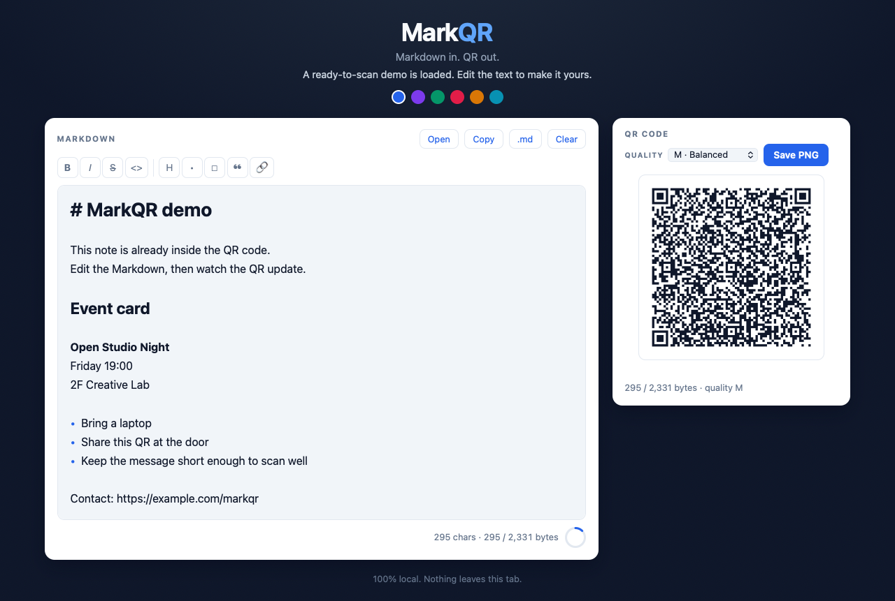

# MarkQR

> **Markdown in. QR out.**

Markdownを、**読める文章**と**読み取れるQRコード**に同時変換するローカルエディタ。

短いメモ・イベント案内・プロフィール・URL付き文章などを、リアルタイムでプレビューしながらQRコード化できます。サーバー不要・完全ローカルで動作します。

## 機能（MVP）

1. 初回アクセス時に、そのまま試せるデモMarkdownを表示
2. CodeMirror上でMarkdownを入力しながらライブ表示
3. 入力内容をQRコードとしてリアルタイム生成
4. QRコードをPNGで保存
5. QR容量の使用量を表示し、容量超過時はQR生成を抑止してクラッシュを防止
6. Markdownファイルの読み込み、コピー、`.md` 保存に対応

## 技術構成

- React 19 + TypeScript + Vite
- Markdown編集: CodeMirror + `@codemirror/lang-markdown`
- QRコード生成: `qrcode.react`（`QRCodeCanvas`）
- 状態管理: React Hooks + `sessionStorage`

## 今後の展望

- 音声認識して、遠距離からも現在喋っていることが変化していくようなシステム
- プレゼン・イベント向けのリアルタイムQR共有モード
- QRコードの容量最適化アルゴリズムの実装
